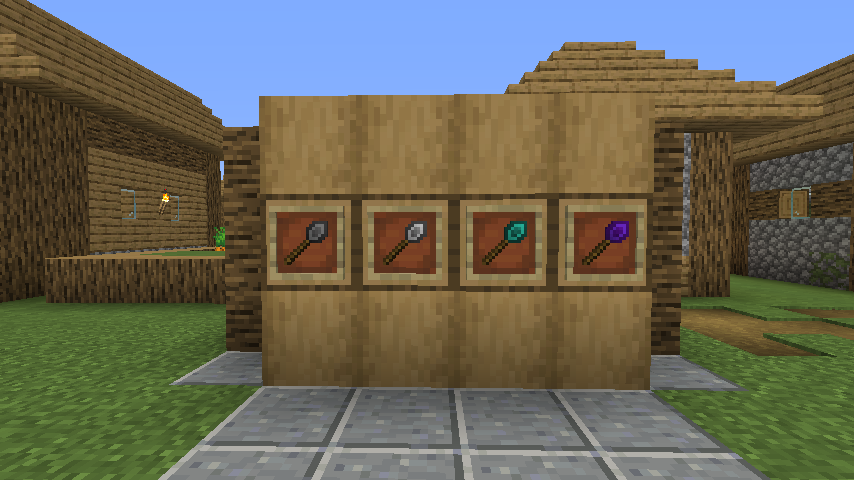

# Construction Wand

With a Construction Wand you can place multiple blocks (up to 1024) at once, extending your build on the side you're
facing. Sneak+Right click to activate angel mode which allows you to place a block at the opposite side of the block
facing you. If you concentrate enough, you can even conjure a block in mid air!

**Note:** These are the instructions for ConstructionWand version 2.0+, which introduced some new features.
If you are still using version 1.x, refer to [those](https://github.com/Theta-Dev/ConstructionWand/tree/1.16.2-1.7)
instructions.

## Wands

There are basic wands made from stone, iron and diamond and the Infinity wand. Wands from higher tiers are more powerful
and last longer. These properties can be changed in the config.

| Wand     | Durability  | Max. Blocks | Upgradeable | Angel distance | Max. Blocks (Destroy) |
|----------|-------------|-------------|-------------|----------------|-----------------------|
| Stone    | 131         | 9           | No          | -              | -                     |
| Iron     | 250         | 27          | Yes         | 1              | 9                     |
| Diamond  | 1561        | 128         | Yes         | 4              | 25                    |
| Infinity | Unbreakable | 1024        | Yes         | 8              | 81                    |

## Crafting

## OPTKEY

To change a wand's core and options or undo your placement you need to hold down the wand option key
(refered as OPTKEY). By default, this is CTRL, but it can be changed in the client config file. To prevent unwanted
changes to your options, you can configure that you have to hold down SNEAK as well to change options or open up the
GUI.

## Wand cores

Wand cores are magical gemstones that make your wand do its thing.

Every wand comes with a Construction core. You can make your wand even better by putting
aditional cores into it. Put your new core together with your wand in a
crafting grid to install it. To switch between cores, hold down OPTKEY and left click empty space
with your wand.
Stone wands can't be upgraded.

**Construction core**

Extend your build on the side facing you. Maximum number of blocks depends on wand tier.
Hold down OPTKEY and scroll to change placement restriction
(Horizontal, Vertical, North/South, East/West, No lock).

**Angel core**

Place a block on the opposite side of the block (or row of blocks) you are facing. Maximum distance depends
on wand tier. Right click empty space to place a block in midair (similar to angel blocks, hence the name).
To do that, you'll need to have the block you want to place in your offhand. You can't place a block in midair
if you've fallen more than 10 blocks deep (no easy rescue tool from falling into the void).

**Destruction core**

Destroy blocks (no tile entities) on the side facing you. Maximum number of blocks depends on wand tier.
Restrictions work just like with the Construction core. Destroyed blocks disappear into the void,
you can use the undo feature if you've made a mistake.

## Options
SHIFT+Right clicking empty space opens the option screen of your wand.

**Restriction:** If restriction is enabled the wand will only place blocks in one row or column
(choose between North/South, East/West on a horizontal plane and Horizontal, Vertical on a vertical plane).
If the direction lock is switched off, the wand will extend the entire face of the building it's pointed at.
This option has no effect in Angel mode.

**Direction:** If set to "Player" the wand places blocks in the same direction as if they were placed by yourself.
Target mode places the blocks in the same direction as their supporting block. See the picture below:

**Replacement:** Enables/disables the replacement of replaceable blocks (Fluids, snow, tallgrass).

**Matching:** Select which blocks are extended by the wand. If set to "EXACT" it will only extend blocks that
are exactly the same as the selected block. 
"SIMILAR" will treat similar blocks equally (e.g. extend dirt and grass blocks). 
"ANY" will extend any block on the face of the building you're looking at.

**Random:** If random mode is enabled, the wand places random blocks from your hotbar. 
~~Shamelessly stolen~~ Inspired by the Trowel from Quark.

## Undo
Holding down SHIFT+CTRL while looking at a blocks will show you the last blocks you placed with a green border
around them. SHIFT+CTRL+Right clickking any of them will undo the operation, giving you all the items back.
If you used the Destruction core, it will restore the blocks.

## Additional features
- If you have shulker boxes in your inventory filled with blocks, the wand can pull them out and place them

- Botania compatibility: The Black Hole Talisman can supply blocks just like shulker boxes can.
  Having a Rod of the Lands / Rod of the Depths in your inventory will provide you with infinite dirt/cobble
  at the cost of Mana.

- Having blocks in your offhand will place them instead of the block you're looking at

- Look at your statisics to see how many blocks you have placed using your wand

- **1.16+ only:** The Infinity Wand won't burn in lava just like netherite gear.

## Contributions and #Hacktoberfest
As #Hacktoberfest now requires repo owners to opt in, I added the tag to this repository.

I'd really appreciate translations. Currently, ConstructionWand only has English and German,
so if you speak any other language you can help translate the mod and add a new language file
under `src/main/resources/assets/constructionwand/lang/`.

## TileEntity Blacklist
Some modded TileEntitys can cause issues when placed using a wand. They may turn into invisible and
unremovable ghost blocks, become unbreakable or cause other unwanted effects.

That's why I've included a Black/Whitelist system
for TileEntities in CW Version 1.7. Chisels&Bits blocks are blacklisted by default.
There are probably a few other tile entities from other mods out there which may cause issues as well.
If you find some of them you can tell me by creating
an issue, commenting on Curse or editing the default blacklist yourself
(it is located at https://github.com/Theta-Dev/ConstructionWand/blob/1.16.2/src/main/java/thetadev/constructionwand/basics/ConfigServer.java#L28)
and making a PR.
